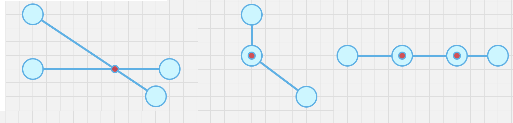

# `segment-intersection`



Fast segment 2D intersection, that includes edge cases, such as segments touching points, or one segment being on top of the other.

## API

```ts
import { intersection, findIntersection } from 'segment-intersection';

const isect(x0, y0, x1, y1, x2, y2, x3, y3);
console.log(isect); // 0, 1 or 2
console.log(intersection); // [[x, y], [x, y]]
```

If `isect === 1`, your intersection point is `intersection[0]`.

Also, you can write into an existing array:

```ts
import { findIntersection } from 'segment-intersection';
const intersection = [
  [0, 0],
  [0, 0],
];
const isect = findIntersection(x0, y0, x1, y1, x2, y2, x3, y3, intersection);
```

### Benchmark

```
-  segment-intersection x 12,139,495 ops/sec ±0.81% (88 runs sampled)
 -  exact-segment-intersect x 1,149,191 ops/sec ±2.38% (89 runs sampled)
 -  segseg x 5,492,533 ops/sec ±4.01% (86 runs sampled)
```

### Run Playground

```bash
npm run dev
```

### Build Playground (preview)

```bash
npm run demo
```

### Build Library

```bash
npm run build
```

### Lint

```bash
npm run lint
```

### Test

```bash
npm run test
```

### Test + Watch

```bash
npm run test:watch
```

### Test + Coverage

```bash
npm run coverage
```

## License

[MIT License](./LICENSE)

Copyright (c) Alex Milevski ([@w8r](https://github.com/w8r))
